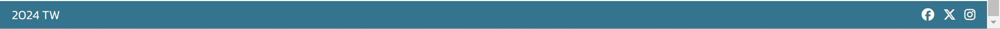

# Website Goals

## Customer Goals

- Find other outgoing people who visit similar locations
- Discover new locations to visit
- Compare practices, photography skills and routes
- Gain inspiration to go out and explore

## Business Goals

- Create a connected community of explorers
- Provide a space to share experiences
- Prioritise UX to maximise time spent on site
- Use bright pictures and calm colours to stimulate positive emotions

# User Experience

## Potential Users

- Outgoing people of any age looking for new routes and locations to visit
- Adventurers hoping to share their journeys
- People living in the area
- Tourists visiting the area

## User Stories

__New User__

- I want to know what the site is about
- I want the site navigation to be intuitive and quick
- I want to gain some new knowledge/insight into the peak district
- I want to be inspired to go on my own adventures in the future

__Returning User__

- I want to see if there are any new pictures or locations on the gallery/map pages
- I want to upload my own photos and view other members' photos.
- I want the site to have the same layout and navigation system as before for ease of use
- I want to be reminded of my times adventuring and to want to do it again

__Site Administrator__

- The page should be easily manageable
- The code should be well commented

# Wireframes

__Small Screens__

   

 

__Medium Screens & Bigger__

   

My initial plan was to have an interactive map on page 2. The map would have had icons at each location which would provide the link to the relevant section. I soon realised this is above my current scope and would require a level understanding of JavaScript. I then attempted to utilise a separate iframe element per location, containing the relevant Google Maps page for each. I had several problems with this. Firstly, Google and Bing Maps do not allow their content to be shown within GitPod repositories. I then found an alternative map that would allow this, but the sizing of the maps within the iframes was too small for my chosen layout. I eventually opted to not include the map in the webpage, and instead provide a link to Google Maps.

Another change made since the initial wireframes was to give the second page the title "Where to Visit". This allowed me to use the heading "Gallery" for the photo section on the community page. It could have been confusing for some users to call page 2 Gallery and then have a group of images on the next page. I also decided against putting the text on the landing page above the hero image. This decision was simply for page continuity.

I initially planned to use the same design for screen sizes medium and larger. I quickly discovered that this choice was not wise on my homepage due to how small the images would have to be. I chose a separate layout with only three images instead of six. For most of the site, the medium and large screens are the same.

# Design

## Colour Scheme

|`#ffffff`                                                 |`#fffaf0`                                                 |`#eefaff`                                                 |`#35748e`                                                 |`#000000`                                                 |
|----------------------------------------------------------|----------------------------------------------------------|----------------------------------------------------------|----------------------------------------------------------|----------------------------------------------------------|
||||||
 
The colours I selected were chosen to encapsulate the fresh feeling one gets when in the countryside. The fresh air and blue skies are represented in the light colours. The very light blue is used an alternative background to the white white, to make successive sections stand out next to each other. The bold blue is a representation of the strength required to conquer the elements. I used this shade for the header and footer, and for the contents box on the visit page. For the text on these areas, as well as for the main h1 headings, I used the floralwhite preset. This off-white gave a subtle warmth to these sections. Black text was used for the rest of the page.

## Features

Font: Kanit. I chose this font due to its clean style. it strikes the midpoint between curvy and blocky. I used its em form for the main headings which really stands out and looks smart on top of my hero image.

I designed my favicon on favicon.cc using te 16x16 form. Its design is some hills in the distance on a bright day with blue skies. It is not hugely clear what it is showing when in the tab, however its roundedness and colourfulness make it stand out enough.

This combination of blue and off-white really catches the eye, but does not overwhelm the serenity of the page.

