# Website Goals

## Customer Goals

- Find other outgoing people who visit similar locations
- Discover new locations to visit
- Compare practices, photography skills and routes
- Gain inspiration to go out and explore

## Business Goals

- Create a connected community of explorers
- Provide a space to share experiences
- Prioritise UX to maximise time spent on site
- Use bright pictures and calm colours to stimulate positive emotions

# User Experience

## Potential Users

- Outgoing people of any age looking for new routes and locations to visit
- Adventurers hoping to share their journeys
- People living in the area
- Tourists visiting the area

## User Stories

__New User__

- I want to know what the site is about
- I want the site navigation to be intuitive and quick
- I want to gain some new knowledge/insight into the peak district
- I want to be inspired to go on my own adventures in the future

__Returning User__

- I want to see if there are any new pictures or locations on the gallery/map pages
- I want to upload my own photos and view other members' photos.
- I want the site to have the same layout and navigation system as before for ease of use
- I want to be reminded of my times adventuring and to want to do it again

__Site Administrator__

- The page should be easily manageable
- The code should be well commented

# Wireframes

__Small Screens__

   

 

__Medium Screens & Bigger__

   

My initial plan was to have an interactive map on page 2. The map would have had icons at each location which would provide the link to the relevant section. I soon realised this is above my current scope and would require a level understanding of JavaScript. I then attempted to utilise a separate iframe element per location, containing the relevant Google Maps page for each. I had several problems with this. Firstly, Google and Bing Maps do not allow their content to be shown within GitPod repositories. I then found an alternative map that would allow this, but the sizing of the maps within the iframes was too small for my chosen layout. I eventually opted to not include the map in the webpage, and instead provide a link to Google Maps.

Another change made since the initial wireframes was to give the second page the title "Where to Visit". This allowed me to use the heading "Gallery" for the photo section on the community page. It could have been confusing for some users to call page 2 Gallery and then have a group of images on the next page. I also decided against putting the text on the landing page above the hero image. This decision was simply for page continuity.

I initially planned to use the same design for screen sizes medium and larger. I quickly discovered that this choice was not wise on my homepage due to how small the images would have to be. I chose a separate layout with only three images instead of six. For most of the site, the medium and large screens are the same.

# Design

## Colour Scheme

|`#ffffff`                                                 |`#fffaf0`                                                 |`#eefaff`                                                 |`#35748e`                                                 |`#000000`                                                 |
|----------------------------------------------------------|----------------------------------------------------------|----------------------------------------------------------|----------------------------------------------------------|----------------------------------------------------------|
||||||
 
The colours I selected were chosen to encapsulate the fresh feeling one gets when in the countryside. The fresh air and blue skies are represented in the light colours. The very light blue is used an alternative background to the white white, to make successive sections stand out next to each other. The bold blue is a representation of the strength required to conquer the elements. I used this shade for the header and footer, and for the contents box on the visit page. For the text on these areas, as well as for the main h1 headings, I used the floralwhite preset. This off-white gave a subtle warmth to these sections. Black text was used for the rest of the page.

## Features

__Universal Features__

Font: Kanit. I chose this font due to its clean style. it strikes the midpoint between curvy and blocky. I used its emphasised form for the main headings which really stands out and looks smart on top of my hero image.

I designed my favicon on favicon.cc using te 16x16 form. Its design is some hills in the distance on a bright day with blue skies. It is not hugely clear what it is showing when in the tab, however its roundedness and colourfulness make it stand out enough.

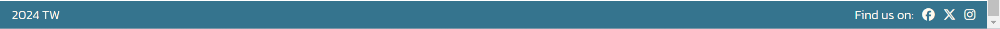

This combination of blue and off-white really catches the eye, but does not overwhelm the serenity of the page. The header changes for small screens; the navigation links collapse and are accessed using the burger button in the top right corner. The footer remains consistent between screen sizes. The social media icons are links that become underlined when hovered over.

__index.html Features__

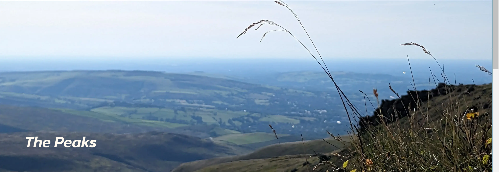
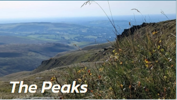

The hero images used were image taken by myself in the peak district. I took many photos there so had a lot of choice. I opted for two very similar pictures of the same view. These images both focus on the grass and flowers in the foreground, with the distant hills out of focus. This worked best with text over the top. I chose to have the text at the bottom of the image to not cover too much, but also so that the mnore detailed areas of the photo do not clash with the heading. They have both been cropped but the small screen image was originally vertical so could be cropped to size without removing any pixels to the left or right. 

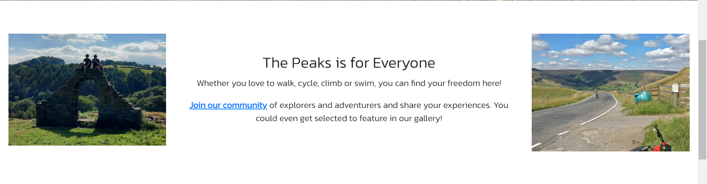
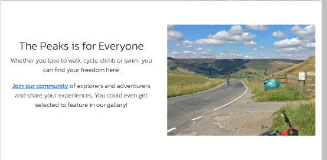
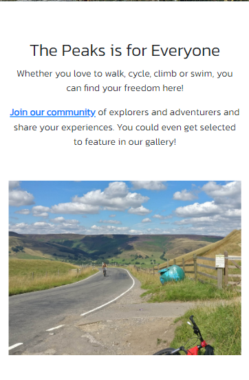

This first section of the homepage features a heading and text informing users of some of the acvtivities on offer in the Peak district. These activities are included in the images throughout the homepage on large screens. On medium and small screens, three images are included instead of six.

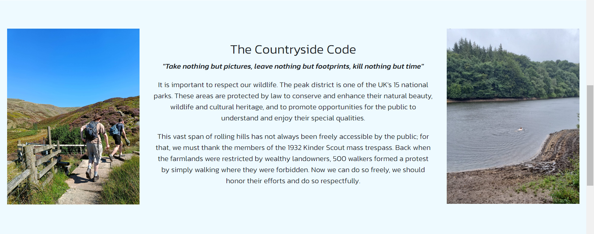
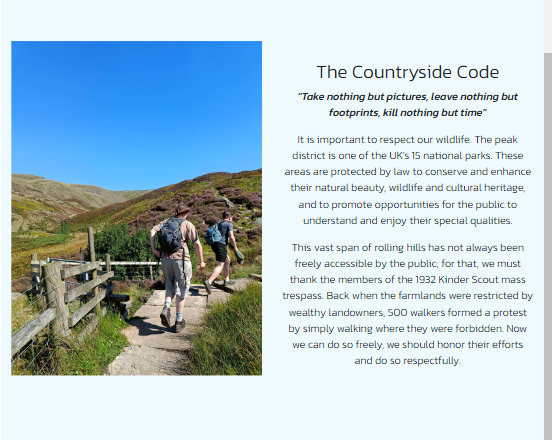
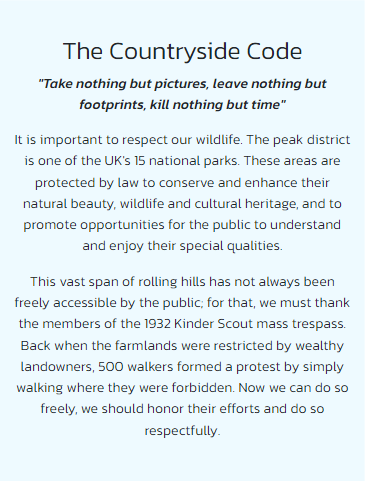

This section is the first display of the light-blue background. On medium and large screens, this was easy to implement. However, on small screens this proved more challenging as the layout changes. I did not want to use a portrait image on the small screen. I instead used the two landscape images from section 3, as seen below. Therefore, for consistency, I had to apply the light blue background to the first image of section 3. I also had to create a new class to apply padding-bottom to the first section so that there is blank white space before the blue starts on small screens. This rule, .vertical-spacing-sm, is also applied to the first image in section 3.

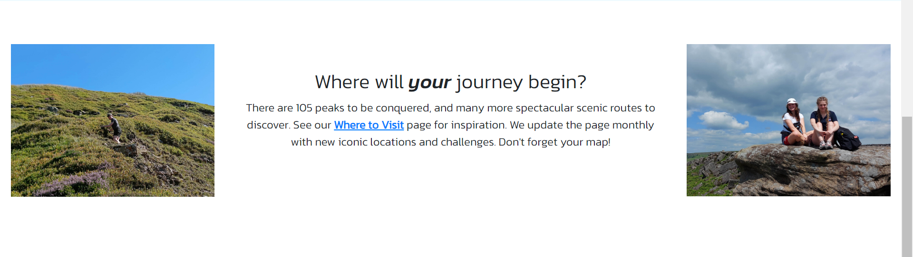
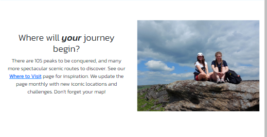
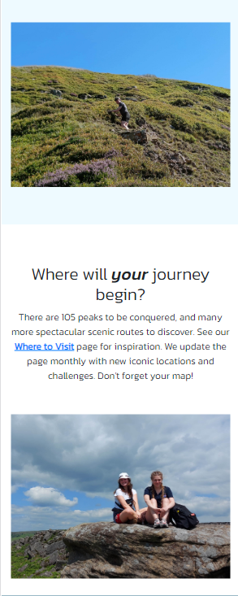

As stated above, this section on small screens contains both images. The light blue background is applied to the first of these on small screens so that the pattern of text + image, text + image, text + image is copied by the background.

__visit.html Features__

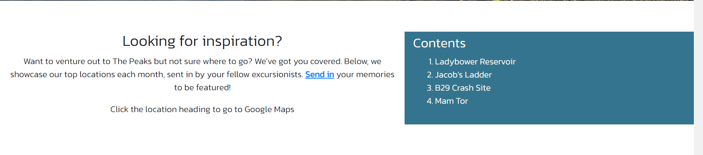
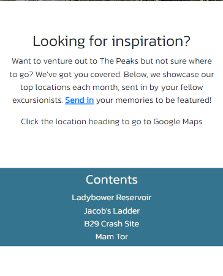

The first section of visit.html contains an introduction to the page and a contents box. These are paced in a bootstrap grid systen of two columns on medium and larger screens, and are set to take up the full width of small screens. The contents box has the same colour scheme as the navigation bar and footer to make it stand out.

The rest of the visit.html page consists of the location titles which link to google maps and an image and description of the location. The page follows the same alternating pattern of white and light blue backgrounds. Each section has the .slim style applied to it, the text is justified and the images have a max height of 85vh to ensure the whole image will be visible. The following rules were used:

.slim {
    margin: 0 3% 0 3%;
}

@media screen and (min-width: 768px) {
    .slim {
        margin: 0 12vw 0 12vw;
    }
}

.justify {
    text-align: justify;
}

.fit {
    max-height: 85vh;
}

__community.html Features__

There is a subtle difference in the h1 element's style in the community.html page compared to the others; the heading is too long to fit on one line on screens of width 384px and longer. This would cause it to continue on the line below so was not on top of the hero image. to fix this, the following css rule was used:

/*Separate style rule for community heading on very small screens due to longer title */
@media screen and (max-width: 384px) {
    #align-join-heading {
        position: absolute;
        top: 52%;
        bottom: 0%; 
        left: 5%; 
        right: 0;
        text-align: left;
        color: floralwhite;
        font-size: larger;
        font-weight: bolder;
        font-style: italic;
    }
}

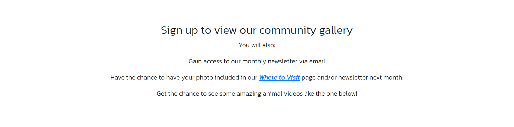

The intro section highlights the features a user will benefit from in order of relevance; uploading images is not the first benefit because it may not apply to all users.

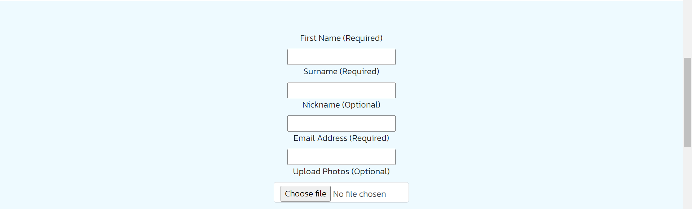
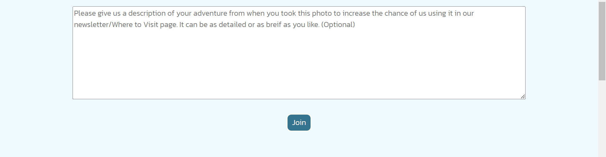

The form section contains several input fields, some of which are necessary and some of which are optional. The Join button is styled to change colour to white when hovered over. Below is some of the html and css code used:

<section class="vertical-spacing centralise gray-background">
            <form action="thankyou.html" class="slim">
                <label for="fname">First Name (Required)</label> 
                <input id="fname" type="text" name="first-name" required aria-label="First Name Required">
                 
                <label for="lname">Surname (Required)</label> 
                <input id="lname" type="text" name="last-name" required aria-label="Surname Required">
                 
                <label for="nname">Nickname (Optional)</label> 
                <input id="nname" type="text" name="nick-name" aria-label="Nickname Optional">
                 
                <label for="email">Email Address (Required)</label> 
                <input id="email" type="email" name="email-address" required aria-label="Email Address Required">
                 
                <label class="form-label" for="custom-file">Upload Photos (Optional)</label>
                 
                <input id="custom-file" type="file" class="form-control" aria-label="Upload Photos Optional">
                  
                <textarea rows="8" name="description" id="text-box" placeholder="Please give us a description of your adventure from when you took this photo to increase the chance of us using it in our newsletter/Where to Visit page. It can be as detailed or as breif as you like. (Optional)"></textarea>
                  
                <input type="submit" value="Join" id="submit-button">
            </form>
        </section>

#submit-button {
    background-color: #35748e;
    color: floralwhite;
    padding: 5px 10px;
    border: 2px solid;
    border-radius: 10px;
}

#submit-button:hover {
    background-color: #ffffff;
    color: black;
}

The final section of the community.html page is a video with a max-height of 85vh, again to ensure the whole video can fit on the screen with some space above and below. This page has the same styles for all screen sizes so different images have not been included.

__thankyou.html Features__

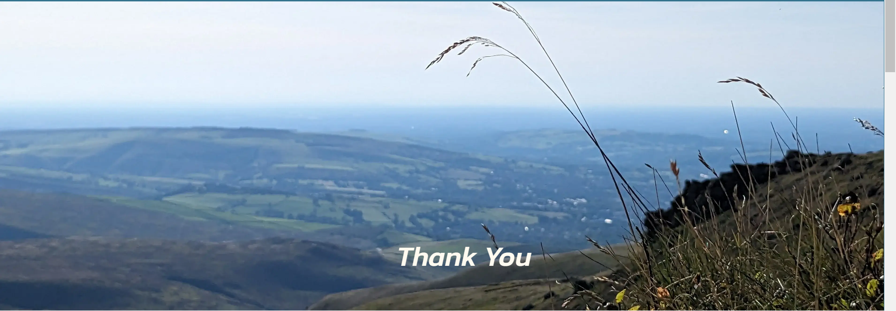

For the landing page, it seemed wise to change up the format slightly to make the message clear that the signup was successful. The h1 element now has the .centralise class so is no longer aligned to the left.

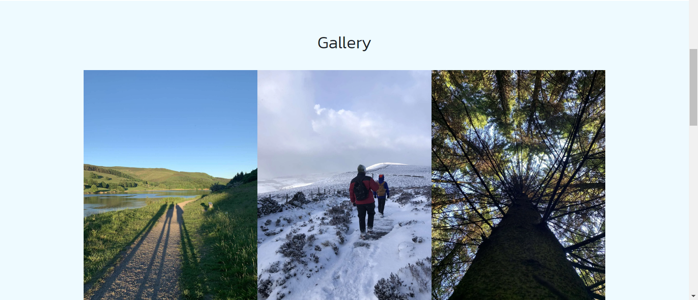
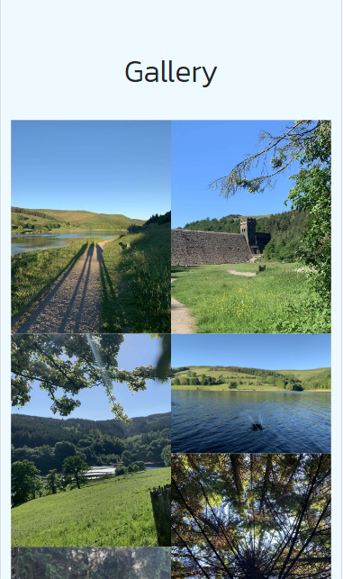

The gallery section has two layouts; three columns for medium and larger screens and two for small screens. they both have the .slim class applied, but the small screen class is within a media query causing a much smaller padding area and increasing the image size.

## Future Features

- Forum page after signing up so that members of the community can interact
- Zooming hero image
- User stories page

# Testing

## W3 Schools

# Tools & Technologies

- [HTML] used for the main site content.
- [CSS] used for the main site design and layout.
- [Git](https://git-scm.com) used for version control. (`git add`, `git commit`, `git push`)
- [GitHub](https://github.com) used for secure online code storage.
- [GitHub Pages](https://pages.github.com) used for hosting the deployed front-end site.
- [Gitpod](https://gitpod.io) used as a cloud-based IDE for development.
- [Bootstrap](https://getbootstrap.com) used as the front-end CSS framework for modern responsiveness and pre-built components.

